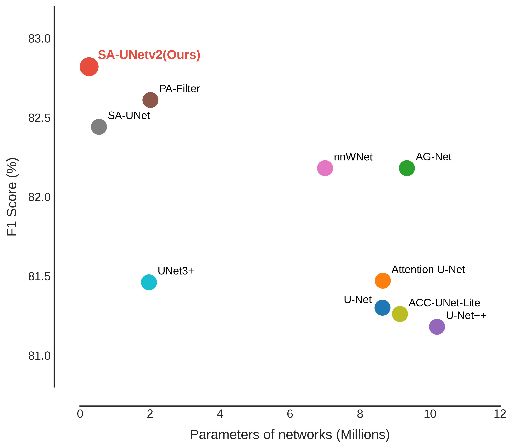
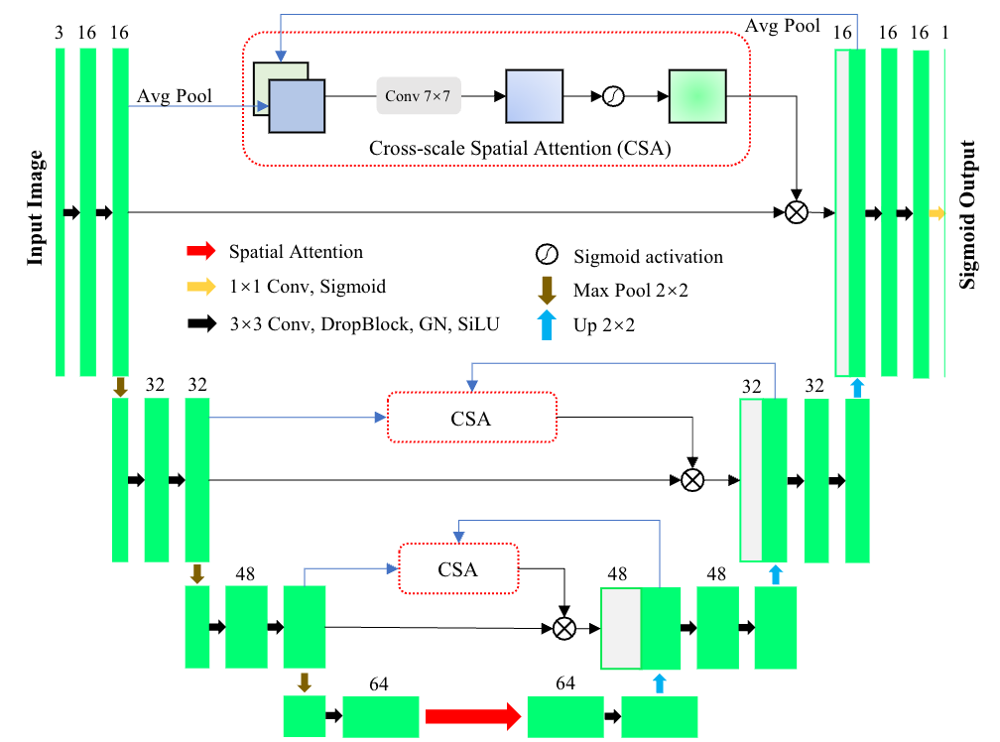

# SA-UNetv2: Rethinking Spatial Attention U-Net for Retinal Vessel Segmentation

[](https://arxiv.org/abs/2509.11774)
[](LICENSE)

This repository contains the official implementation of **SA-UNetv2** (arXiv 2025).

**SA-UNetv2** is a lightweight, efficient, and robust architecture tailored for retinal vessel segmentation. It introduces **Cross-scale Spatial Attention (CSA)** into all skip connections and utilizes a compound **BCE + MCC loss** to handle severe class imbalance.

{ width=400px }
*Figure 1: Comparison of retinal vessel segmentation networks on the DRIVE dataset. SA-UNetv2 achieves the highest F1 score with the lowest model complexity (0.26M parameters).*

## 🌟 Key Features

* **Lightweight:** Only **0.26M parameters** and **1.2MB** memory footprint (approx. 50% reduction compared to SA-UNet).
* **Efficient:** Sub-second inference (approx 0.95s) on CPU for $592 \times 592$ resolution.
* **Cross-scale Spatial Attention (CSA):** Bridges the semantic gap between encoder and decoder features.
* **Improved Convolutional Block:** Adopts `Conv 3x3` → `DropBlock` → `Group Normalization` → `SiLU` for better stability and gradient flow.
* **Robust Loss:** Combines Binary Cross-Entropy (BCE) and Matthews Correlation Coefficient (MCC) loss to tackle vessel-background imbalance.

## ARCHITECTURE


*The architecture of SA-UNetv2. It integrates Cross-scale Spatial Attention (CSA) in skip connections and uses an optimized convolutional block design.*

## 🛠️ Installation

Our environment is based on TensorFlow/Keras. Please install the dependencies as follows:

```bash
# Core requirements
pip install tensorflow==2.12.0
pip install keras_cv==0.5.0
pip install keras-flops
